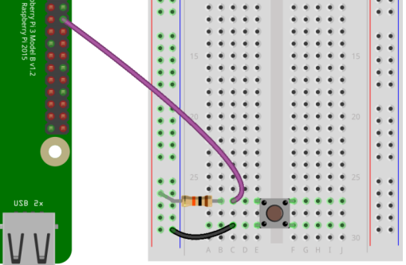

# Button Exercise 1

### Objective

print a message when a button is pressed

### Tools

* 1x 10k ohm resistor
* 1x breadboard
* 1x button
* 2x jumper wires

### Setup

### Sources

* https://www.canakit.com/Media/CanaKit-Raspberry-Pi-Quick-Start-Guide-4.0.pdf

