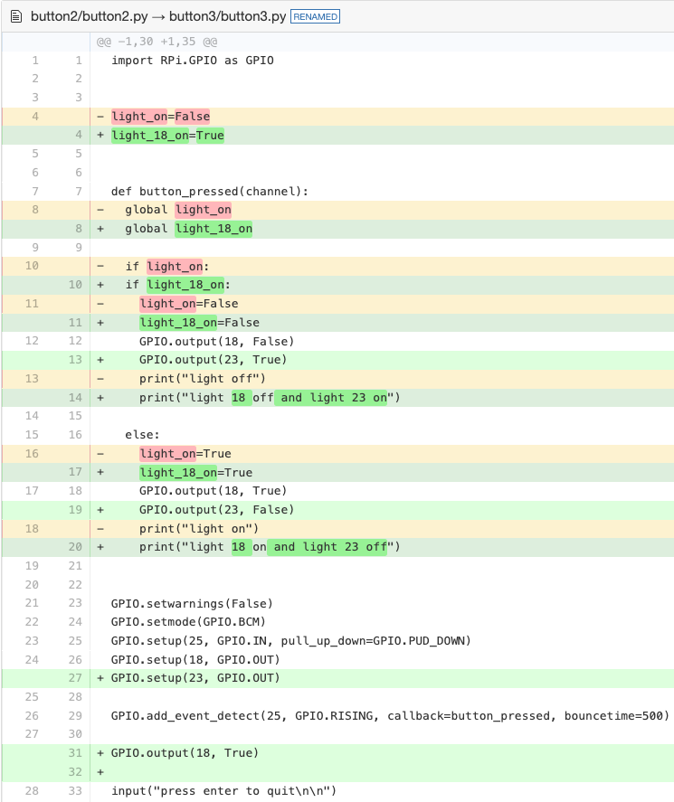

# Button Exercise 2 

### New Tools

* 1x 220 ohm resistor 
* 1x led 
* 1x jumper wires

### Setup

### Sources

* https://www.canakit.com/Media/CanaKit-Raspberry-Pi-Quick-Start-Guide-4.0.pdf
* https://diffy.org/

